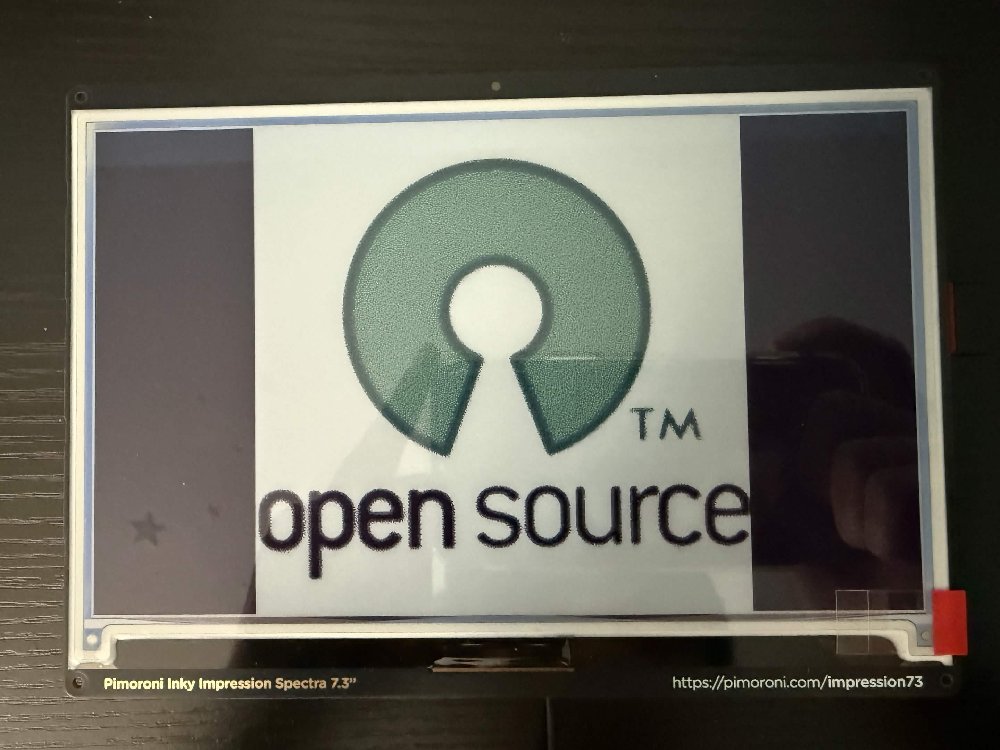
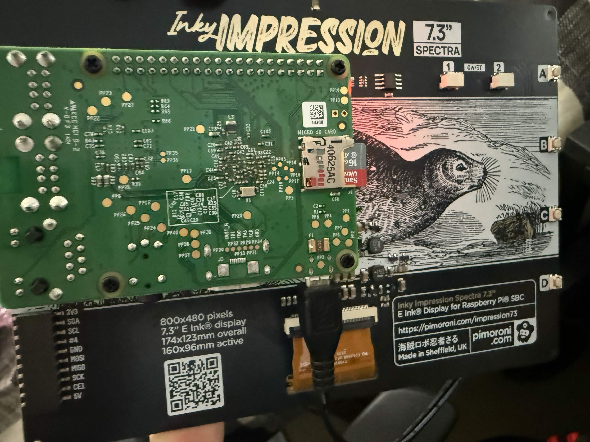
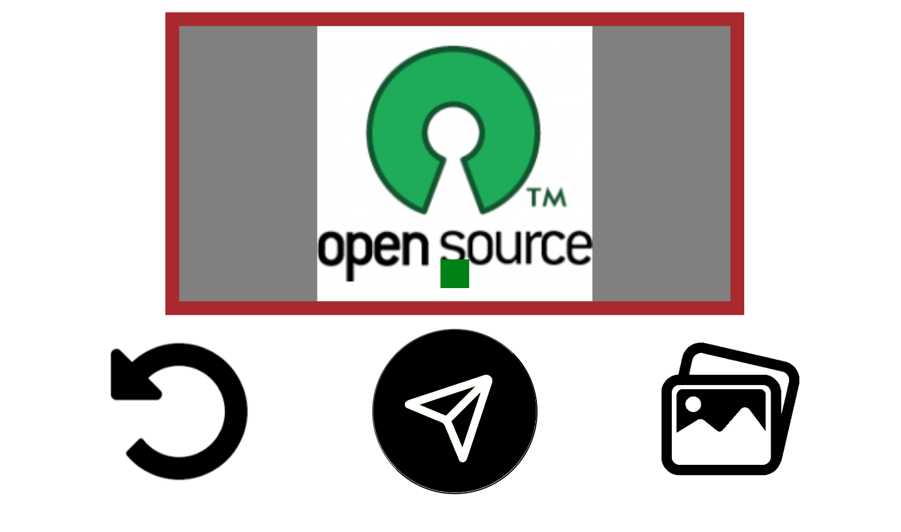
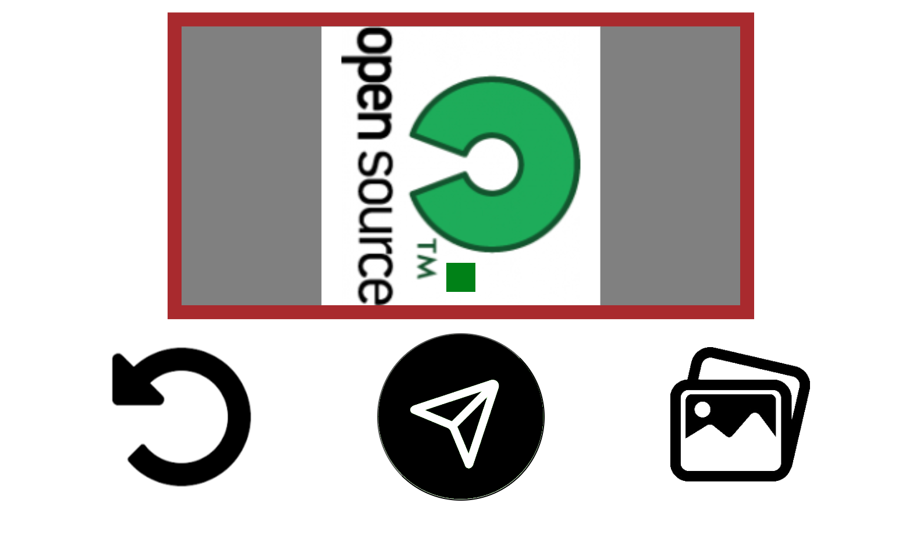

# DigiFrame
This project is a "digital pictureframe" where you can upload pictures and draw it on an E-Ink display!

Features:
- Image rotation on webpage side
- Auto image resize to match specified dimensions while maintaining aspect ratio
- YAML defined settings (mainly for debugging with Qt)

For the software,
- **Flask** for hosting the server
- **Pimoroni Inky Library** for controlling the Inky itself
- **Javascript** for webpage functionality

For the hardware,

- **Computer** - Raspberry Pi 1 B+
- **E-Ink Display** - Inky Impression 2025 7.3'
- **WiFi Card** - [Ralink 5370](https://www.amazon.com/dp/B06Y2HKT75?ref=ppx_yo2ov_dt_b_fed_asin_title)

Here's the front with an image loaded! I don't have a case designed yet


And here's the back!


Here's the webpage

The left button is to rotate the image in increments of 90 degrees

The middle button is to send the image to the server

The right button is to select an image from your gallery

(Ignore the green box...)



Here is a pic of the image rotation



## Folder Directory

```bash
.
├── docs # README stuff 
├── images # Where the images are kept in the server
├── static # Javascript and CSS files for the webpage
├── templates # Where the main `index.html` file is located
├── test # Python test programs (for debugging)
├── util # Python helper code
├── main.py # The main python script
├── server.py # The server code (runs from main, it's in root dir cuz of Flask reasons)
├── requirements.txt # pip requirements
└── settings.yaml # Settings file to change backend options (Inky vs Qt)

```

## Setup

### Setting up venv

```bash
# In repository root folder
python -m venv venv

# Source venv
source venv/bin/activate
```

### Installing Prerequisites

Please install the necessary Python packages!

```bash
pip install -r requirements.txt
```

## Usage

All settings are configured in `settings.yaml`. Here is every option!

```yaml
display: "qt"
# Possible Options:
# "qt" - For using QT as the display
# "inky" - For the Inky Display

host: "0.0.0.0"
port: 8000
```