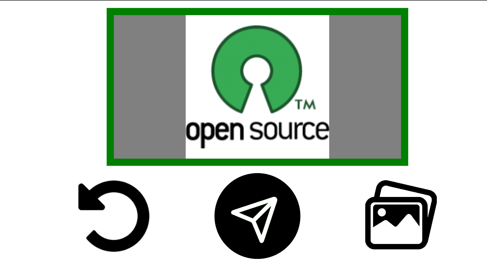
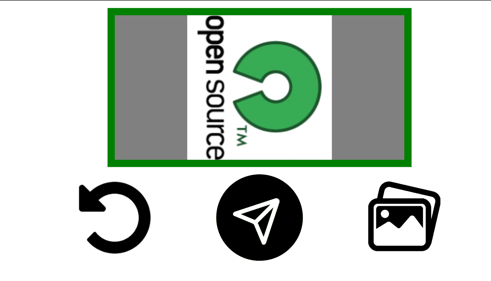

# DigiFrame
This project is a "digital pictureframe" where you can upload pictures and draw it on an E-Ink display!

Features:
- Image rotation on webpage side
- Auto image resize to match specified dimensions while maintaining aspect ratio
- YAML defined settings (mainly for debugging with Qt)

For the software,
- **Flask** for hosting the server
- **Pimoroni Inky Library** for controlling the Inky itself
- **Javascript** for webpage functionality

For the hardware,

- **Computer** - Raspberry Pi 1 B+
- **E-Ink Display** - Inky Impression 2025 7.3'
- **WiFi Card** - [Ralink 5370](https://www.amazon.com/dp/B06Y2HKT75?ref=ppx_yo2ov_dt_b_fed_asin_title)

Here's the front with an image loaded! I don't have a case designed yet


And here's the back!


Here's the webpage

The left button is to rotate the image in increments of 90 degrees

The middle button is to send the image to the server

The right button is to select an image from your gallery

The green border indicates that connection to the server is alive



Here is a pic of the image rotation



## Folder Directory

```bash
.
├── docs # README Resources
├── images # Where the images are kept in the server
├── main.py # Main Script
├── server.py # Code for Flask App (runs from main.py)
├── settings.yaml # YAML settings for changing options on-the-fly
├── setup # Scripts for installing and setting up everything
├── static # Javascript, CSS, and images
├── templates # HTML file
├── util # Helper Python files
├── test # Test scripts for things like running the inky bare
└── README.md # This file!
```

## Setup

### Installing Dependencies

```bash
$ sudo chmod +x setup/install.sh
$ sudo ./setup/install.sh
```

### Enabling SPI and I2C

```bash
$ sudo chmod +x setup/enable_interfaces.sh
$ sudo ./setup/enable_interfaces.sh
```

### Adding .service File

```bash
$ sudo chmod +x setup/add_service.sh
$ sudo ./setup/add_service.sh
```

### Enabling Hotspot

```bash
$ sudo chmod +x setup/hotspot.sh
$ sudo ./setup/hotspot.sh
```

### All-in-One Setup

If you want to do everything all at once, run the following

> **NOTE** This will reboot your Pi! It will also create it's own hotspot.

```bash
$ sudo chmod +x setup/all_in_one.sh
$ sudo ./setup/all_in_one.sh
```

## Usage

All settings are configured in `settings.yaml`. Here is every option!

```yaml
display: "none"
# Possible Options:
# "qt" - For using QT as the display
# "inky" - For the Inky Display
# "none" - For only running the server with no display

host: "0.0.0.0"
port: 8000
```